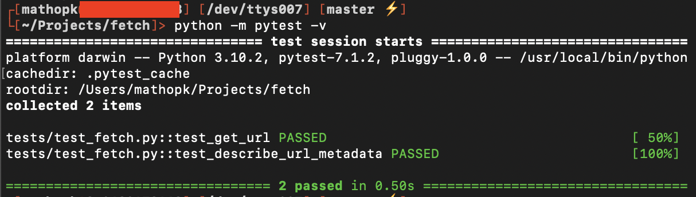
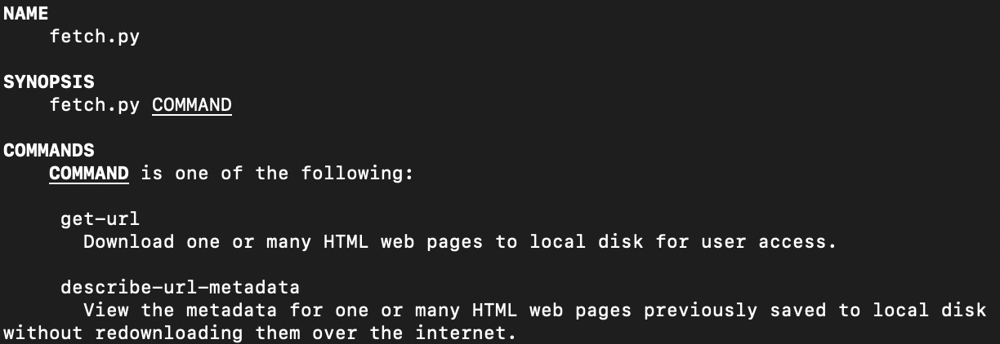
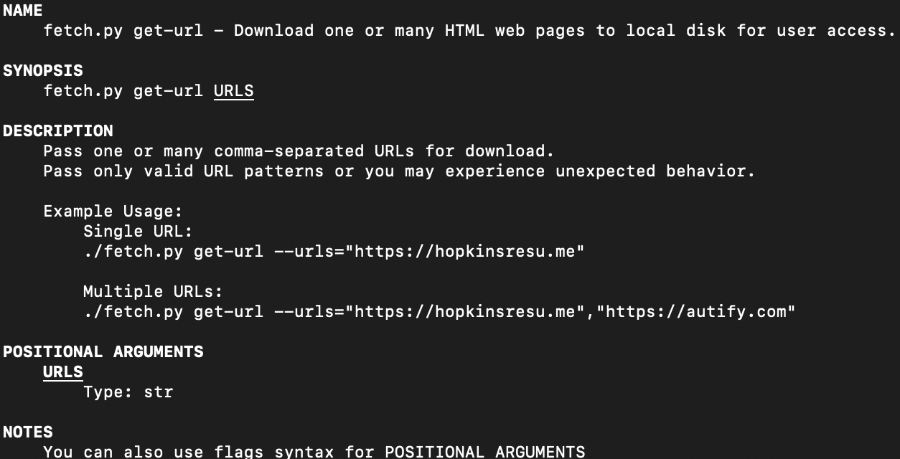

# fetch
fetch is a simple command line tool for downloading HTML of web pages locally on disk. It was written to be OS agnostic (tested on Mac and Windows) and also includes Docker support.

## TODO
- Create more tests
- Add capability to archive all assets instead of just single HTML page for local browsing

## Getting started
As previously mentioned the project is written in Python and is OS agnostic (tested on macOS Monterey and Windows 10). Below are steps to clone the repo and run it in your environment or a Docker environment.

### Setup
Clone this repo locally:

```bash
$ git clone git@github.com:moebaca/fetch.git
$ cd fetch
```

Install PIP dependencies:

```bash
$ pip install -r requirements.txt
```

#### Optional Docker Steps
If you want to use fetch in a clean Docker environment ensure you have Docker installed and run the following:

```bash
$ docker build -t fetch .
```

#### Optional Run tests
To ensure a consistent experience intended by the developer ensure all tests are passing. 

Run the below commands from the fetch directory:

```bash
$ pip install -r requirements_dev.txt
```

```bash
$ python -m pytest -v
```

Output should be similar as shown below:


### Usage
fetch allows you to inspect it's functionality by running the following command:

```bash
$ ./fetch.py -h
```
or in Docker:

```bash
$ fetch -h
```
You should see the following output like below:


You can apply those same steps to the individual commands such as:
```bash
$ ./fetch.py get-url -h
```
or in Docker:

```bash
$ fetch get-url -h
```

